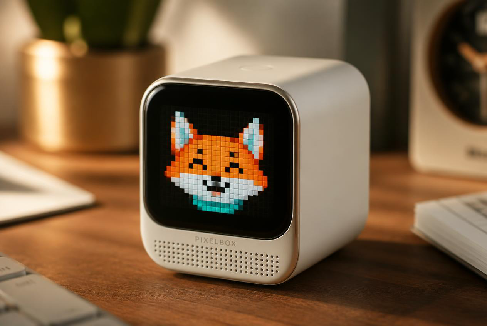
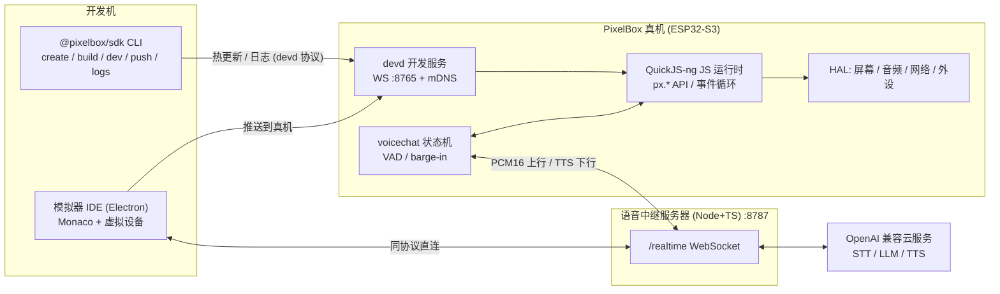

<div align="center">

# PixelBox 像素盒

**放在桌上的、完全可编程的像素动画小盒子**

ESP32-S3 + 1.8" AMOLED · 用 TypeScript 写应用 · 一键热更新到真机 · 语音大模型对话 · Electron 模拟器 IDE



</div>

## 它是什么

PixelBox 在 ESP32-S3 上内嵌完整 JS 运行时(QuickJS-ng),把整台设备抽象成一套
TypeScript API(`px.*`):屏幕、触摸、音频、语音对话、Wi-Fi/BLE、传感器、存储……
你写 TS,保存,1~2 秒后真机上的像素动画就变了——不重烧固件、不碰 C 代码。
没有硬件也能玩:模拟器 IDE 提供与真机同一套 API 和同一个语音协议。

## 特性

- **TypeScript 全栈开发**:`sdk/types/pixelbox.d.ts` 全量类型契约,编辑器补全即文档;esbuild 打包为单文件应用包。
- **秒级热更新**:devd 协议(WebSocket + mDNS 发现)推送应用包,原子切换后仅重启 JS VM,芯片不重启。
- **像素动画引擎**:368×448 AMOLED 画布,`onFrame(dt)` 逐帧渲染(1–60 FPS)、离屏画布、雪碧图/帧动画/GIF、内置像素字体(含中文)。
- **语音大模型对话**:麦克风 → 中继服务器 → STT/LLM/TTS(全部 OpenAI 兼容、可插拔)→ 流式回放,支持说话打断(barge-in)。
- **完整外设 API**:触摸/按键/手势、IMU 摇一摇、Wi-Fi/TCP/UDP/mDNS/BLE、NVS+文件系统、电池电量、OTA;定制板可选摄像头/GPS/灯带。
- **模拟器 IDE**:Electron + Monaco,虚拟像素屏与虚拟外设面板,零硬件跑通全部 API,一键推送真机。
- **硬件零门槛落地**:Stage A 用微雪现成开发板攒机(约 ¥300),Stage B 提供面向新手的定制 PCB 与外壳完整教程。

## 架构总览



详见 [docs/architecture.md](docs/architecture.md)(协议与一致性规则)与
[sdk/types/pixelbox.d.ts](sdk/types/pixelbox.d.ts)(API 唯一事实源)。

## 快速开始(三选一)

### 路径 1:模拟器最速体验(零硬件,10 分钟)

```bash
cd simulator && npm install && npm run dev
```

打开示例工程(`examples/`),编辑器里改代码,虚拟像素屏实时刷新。

### 路径 2:真机热更新(需微雪开发板)

```bash
# 固件(需 ESP-IDF v5.5,详细步骤见 docs/getting-started.md)
tools/fetch_deps.sh
cd firmware && idf.py set-target esp32s3 && idf.py build
idf.py -p <串口> flash monitor

# SDK CLI
cd sdk && npm install && npm run build && npm link
pixelbox create my-app && cd my-app && npm install
pixelbox dev        # watch 构建 + 自动推送 + 日志回传
```

### 路径 3:语音对话

```bash
cd server && npm install
cp .env.example .env   # 填 OpenAI 兼容的 STT/LLM/TTS baseURL/key/model
npm run dev            # ws://<本机>:8787/realtime
```

设备端 `px.voice.configure({ serverUrl: 'ws://<电脑局域网IP>:8787/realtime' })` 后按键开聊。

完整教程(购板 → 装环境 → 烧录 → 热更新 → 语音 → 排错表):**[docs/getting-started.md](docs/getting-started.md)**

## 仓库导航

| 目录 | 内容 | 入口 |
|---|---|---|
| `docs/` | 架构、产品、上手、硬件落地指南 | [architecture.md](docs/architecture.md) · [product.md](docs/product.md) · [getting-started.md](docs/getting-started.md) |
| `docs/hardware/` | 开发板攒机 / 定制 PCB / 外壳 / BOM | [devboard.md](docs/hardware/devboard.md) · [custom-pcb.md](docs/hardware/custom-pcb.md) · [enclosure.md](docs/hardware/enclosure.md) · [bom.md](docs/hardware/bom.md) |
| `firmware/` | ESP-IDF v5.5 固件(QuickJS-ng / devd / voicechat / HAL) | [firmware/README.md](firmware/README.md) |
| `sdk/` | `@pixelbox/sdk`:d.ts 契约 + CLI | [sdk/README.md](sdk/README.md) |
| `simulator/` | Electron 模拟器 IDE | [simulator/README.md](simulator/README.md) |
| `server/` | 语音中继服务器(STT/LLM/TTS 可插拔) | [server/README.md](server/README.md) |
| `examples/` | 示例应用:像素动画/时钟/语音助手/传感器 | [examples/README.md](examples/README.md) |
| `tools/` | 依赖拉取、字体生成等脚本 | — |

## 硬件路线

| | Stage A:开发板攒机 | Stage B:定制 PCB |
|---|---|---|
| 门槛 | 零 PCB 知识,焊两根喇叭线 | 立创 EDA + 嘉立创打样(教程面向新手) |
| 硬件 | 微雪 ESP32-S3-Touch-AMOLED-1.8 + 喇叭 + 电池 + 3D 打印外壳 | 增加 OV2640 摄像头 / GPS / WS2812 灯带 / 定制外形 |
| 预算(估算) | ≈ ¥320/台 | ≈ ¥1200~2000(含两轮打样) |
| 指南 | [devboard.md](docs/hardware/devboard.md) | [custom-pcb.md](docs/hardware/custom-pcb.md) |

## 一段最小应用

```ts
// src/main.ts —— 保存即热更新到真机
px.screen.setFps(30);
px.screen.onFrame((dt) => {
  px.screen.clear(0x000000);
  const t = performance.now() / 300;
  const y = 200 + Math.sin(t) * 60;
  px.screen.fillCircle(184, y | 0, 20, px.color.hsv((t * 40) % 360, 100, 100));
  px.screen.drawText('你好, PixelBox!', 8, 8, { font: 'pixel12', color: px.color.WHITE });
});

px.input.onButton((ev) => {
  if (ev.type === 'click') px.voice.start(); // 按一下,开始语音对话
});
```

## 许可证

本项目以 **MIT 许可证** 开源(见仓库 LICENSE 文件)。
第三方组件(QuickJS-ng、ESP-IDF 等)遵循其各自的开源许可证;
`docs/assets/` 下渲染图仅用于本项目文档展示。
