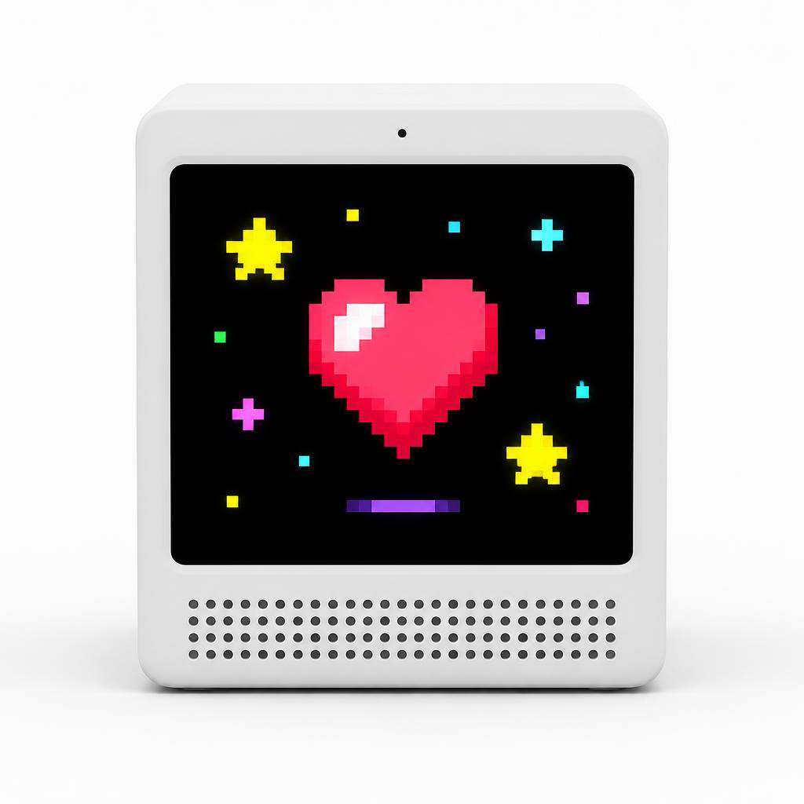
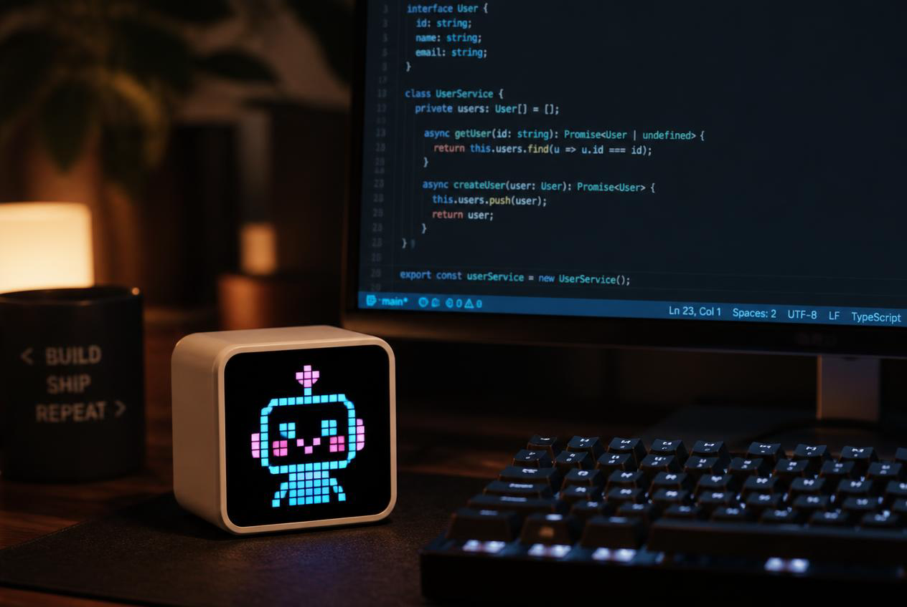
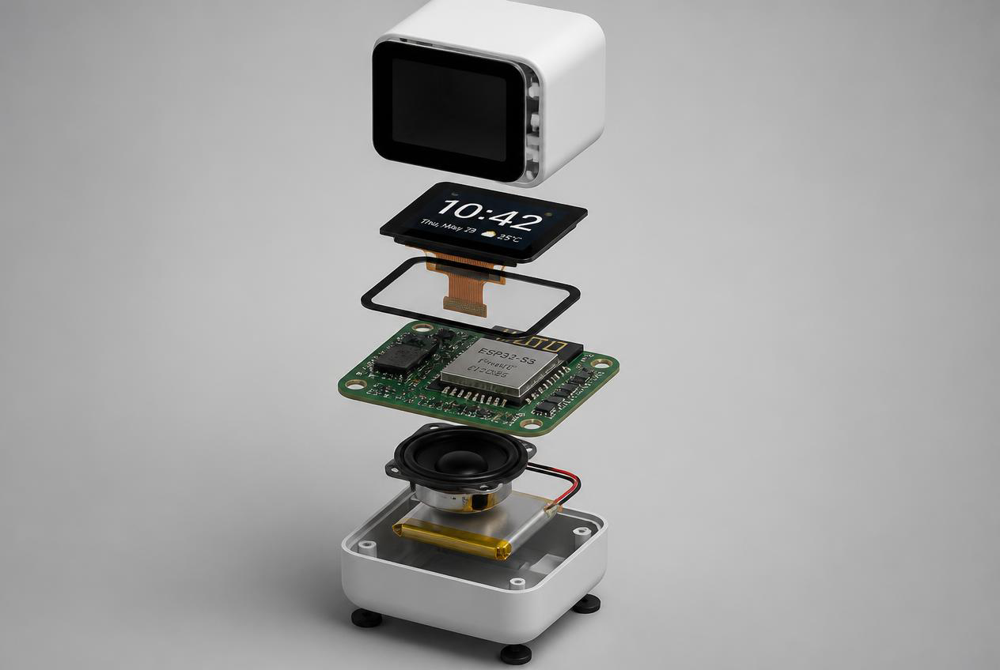

# PixelBox 像素盒 — 产品文档

> 本文描述 PixelBox 的产品定义、目标形态、交互方式与软硬件能力清单。
> 架构与协议见 [architecture.md](./architecture.md);API 契约见 [`sdk/types/pixelbox.d.ts`](../sdk/types/pixelbox.d.ts)。

## 1. 一句话定义

**PixelBox 是一个放在桌面上的、完全可编程的像素动画小盒子**:
1.8 英寸 AMOLED 屏幕显示像素动画/表情/信息面板,内置麦克风与扬声器可以和大模型语音对话,
开发者用 **TypeScript** 写应用,一条命令热更新推送到真机——不用重新烧录固件,不用碰 C 代码。

它同时是三样东西:

| 视角 | 它是什么 |
|---|---|
| 普通用户 | 一个会说话、会卖萌的桌面像素宠物 / 时钟 / 信息屏 |
| 前端 / Node 工程师 | 一块用 TS + `px.*` API 就能编程的硬件画布,带模拟器和热更新 |
| 嵌入式爱好者 | 一套开放的 ESP32-S3 + QuickJS 固件方案,可以自己打板扩展摄像头 / GPS / 灯带 |

## 2. 目标形态

### 2.1 外观

圆角小方盒(目标体量约 5 cm 见方的桌面摆件级别,最终尺寸以外壳设计为准,见
[hardware/enclosure.md](./hardware/enclosure.md)),正面几乎被屏幕占满,屏下是扬声器透声孔阵列,
顶部一颗实体按键,背部 USB-C 供电/调试口。

| | |
|---|---|
|  |  |
| 正面:屏幕 + 透声孔阵列 + 麦克风开孔 | 与开发机并肩工作:代码保存即热更新上屏 |

### 2.2 内部堆叠

自上而下:外壳前框 → AMOLED 屏(含触摸)→ 主板(ESP32-S3)→ 扬声器 → 锂电池 → 底壳。
两条硬件路线:

- **Stage A(推荐首发)**:直接用微雪 ESP32-S3-Touch-AMOLED-1.8 开发板 + 外接喇叭 + 电池 + 3D 打印外壳,零 PCB 门槛。见 [hardware/devboard.md](./hardware/devboard.md)。
- **Stage B(进阶)**:定制 PCB,增加摄像头 / GPS / 灯带等外设。见 [hardware/custom-pcb.md](./hardware/custom-pcb.md)。

### 2.3 交互方式

| 交互 | 硬件 | 对应 API(`pixelbox.d.ts`) |
|---|---|---|
| 触摸屏幕(点/滑) | FT3168 电容触摸 | `px.input.onTouch` / `px.input.onGesture` |
| 实体按键(单击/双击/长按) | 板载 BOOT 键 + 可扩展按键 | `px.input.onButton` |
| 语音对话(听→想→说,可打断) | MEMS 麦克风 + ES8311 + 喇叭 | `px.voice.*` |
| 摇一摇 / 翻转姿态 | QMI8658 IMU | `px.sensors.imu.onShake` / `onOrientation` |
| 低电量 / 充电提示 | AXP2101 PMU | `px.system.on('lowBattery' \| 'chargingChange')` |

典型使用循环:桌面待机显示像素时钟或宠物动画 → 用户按键/唤醒发起语音对话
(状态机 `idle → listening → thinking → speaking`,说话中可 barge-in 打断)→
对话结束回到动画。开发者随时在电脑上改代码,保存后 1~2 秒内热更新到盒子。

## 3. 软件能力清单

以下能力全部以 [`sdk/types/pixelbox.d.ts`](../sdk/types/pixelbox.d.ts) 为唯一契约,
固件与模拟器双端实现一致;硬件未启用的域 `available()` 返回 `false`。

### 3.1 设备端运行时(固件内置)

| 域 | 能力摘要 |
|---|---|
| JS 运行时 | QuickJS-ng(ES2023),JS 堆走 PSRAM(上限 4MB);标准全局:`console` / 定时器 / `fetch` / `WebSocket` / `TextEncoder` / `atob` / `performance` |
| `px.screen` | 368×448 像素画布:点/线/矩形/圆/文本(内置 pixel8/12/16 像素字体,含常用中文)/图片(PNG/JPEG/GIF);离屏 `PxCanvas`;`onFrame(dt)` 逐帧渲染(1–60 FPS);帧动画与雪碧图 `createAnimation`、`loadGif` |
| `px.input` | 触摸(down/move/up)、按键(click/doubleClick/longPress)、滑动手势 |
| `px.audio` | 扬声器音量、麦克风 PCM 流(8k–48k)、wav/mp3 播放、原始 PCM 与流式 PCM(TTS 用)、蜂鸣、录音到文件 |
| `px.voice` | 一句话对话 / 持续对话 / 文本输入 / `say()` 播报;事件:状态机、识别文本、LLM 增量、音量律动;支持打断(barge-in);经中继服务器接任意 OpenAI 兼容 STT/LLM/TTS |
| `px.wifi` / `px.net` | 扫描/连接/SoftAP 配网;TCP/UDP/mDNS 发现与广播 |
| `px.ble` | NimBLE 外设(GATT 广播)与中心(扫描/连接/读写/订阅)双角色 |
| `px.storage` | NVS 键值(`kv`)+ LittleFS 文件系统(可写 `/data`,应用包只读 `/app`) |
| `px.system` | 设备信息/内存/电池/重启/深睡/NTP/时区/芯片温度/固件 OTA |
| `px.app` | 应用元信息、包内资源读取、退出钩子(热更新前收尾) |
| `px.sensors` | IMU 原始数据流、摇一摇、姿态方向 |
| `px.camera` / `px.gps` / `px.led` | 定制板可选外设(OV2640 拍照与推流 / NMEA 定位 / WS2812 灯带),Stage A 上 `available() === false` |
| `px.util` / `px.color` | Base64/Hex/CRC32/SHA-256/UUID;RGB/HSV/颜色插值与常用色常量 |

### 3.2 开发工具链

| 工具 | 能力 |
|---|---|
| `@pixelbox/sdk` CLI | `create` 脚手架、`build`(esbuild 打包 TS → 单文件 ES2020)、`push` 推送真机、`dev` watch+自动推送+日志、`logs`、`devices`(mDNS 发现) |
| 热更新 | devd 协议(WS 8765)推应用包 → 校验 → 原子切换 → 仅重启 JS VM(不重启芯片),秒级生效 |
| 模拟器 IDE | Electron 桌面应用:文件树 + Monaco 编辑器(注入 d.ts 全量补全)+ 像素屏 canvas + 虚拟外设面板(按键/摇一摇/电池/GPS/灯带)+ 控制台;可一键推送到真机 |
| 语音中继服务器 | Node+TS,STT/LLM/TTS 三段可插拔(OpenAI 兼容接口,`.env` 配置 baseURL/key/model),支持流式与打断 |

### 3.3 面向最终用户的开箱能力(示例应用)

`examples/` 提供可直接推送的示例:像素动画/宠物、像素时钟、语音助手、传感器仪表盘。
它们同时是 API 的活文档。

## 4. 硬件能力清单

### 4.1 Stage A — 微雪开发板(默认板型 `BOARD_WAVESHARE_AMOLED_18`)

| 部件 | 型号 | 说明 |
|---|---|---|
| 主控 | ESP32-S3R8(16MB Flash + 8MB Octal PSRAM) | 双核 240MHz,Wi-Fi 2.4G + BLE 5 |
| 屏幕 | 1.8" AMOLED 368×448,驱动 SH8601(QSPI) | 自发光、纯黑省电,像素风绝配 |
| 触摸 | FT3168(I2C) | 电容触摸 |
| 音频 | ES8311 codec + 板载 MEMS 麦 + 板载功放 + 喇叭接口 | 16kHz 语音链路;喇叭需自购焊接 |
| IMU | QMI8658(I2C) | 加速度 + 陀螺仪 |
| 电源 | AXP2101 PMU + 锂电池接口 | 充电管理、电量计 |
| RTC | PCF85063(I2C) | 断电走时 |

### 4.2 Stage B — 定制 PCB 增量能力(固件 Kconfig 可选,默认关闭)

| 部件 | 型号 | 对应 API |
|---|---|---|
| 摄像头 | OV2640(DVP) | `px.camera` |
| 定位 | ATGM336H(UART NMEA) | `px.gps` |
| 灯带 | WS2812 | `px.led` |
| 其他 | 扩展按键、USB-C、定制外壳 | `px.input.onButton`(数字编号) |

> 能力开关最终反映在 `px.system.info().capabilities` 中,应用代码应先查询能力再使用,
> 未启用外设的方法会抛 `Error("ENOTSUP")`(架构一致性规则,见 architecture.md §10)。

## 5. 非目标(明确不做)

- 不做通用 Linux 小电脑:JS 运行时只面向"单前台应用 + 事件驱动"模型,不提供多进程/多应用并行。
- 不在设备端跑大模型:语音理解全部走中继服务器,设备只做 VAD/采播。
- 不做手机 App:开发与控制入口是 CLI 与模拟器 IDE(桌面端)。

## 6. 文档导航

| 想做什么 | 看哪篇 |
|---|---|
| 从零跑通(买板→烧录→热更新→语音) | [getting-started.md](./getting-started.md) |
| 了解总架构与协议 | [architecture.md](./architecture.md) |
| 开发板 + 喇叭 + 电池怎么攒 | [hardware/devboard.md](./hardware/devboard.md) |
| 自己画板打样 | [hardware/custom-pcb.md](./hardware/custom-pcb.md) |
| 外壳怎么落地 | [hardware/enclosure.md](./hardware/enclosure.md) |
| 花多少钱 | [hardware/bom.md](./hardware/bom.md) |
